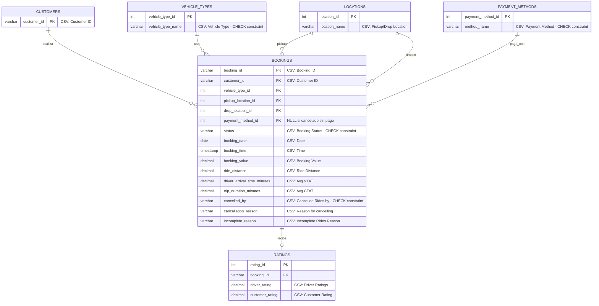

# Modelo Entidad-Relación - Sistema Uber

## Diagrama ER Simplificado

## Cambios del Modelo Original

### ❌ Entidades Eliminadas
1. **TIME_DIMENSION** → Integrada en BOOKINGS (booking_date, booking_time)
2. **BOOKING_STATUS** → Reemplazada por CHECK constraint en BOOKINGS.status
3. **CANCELLATIONS** → Columnas integradas en BOOKINGS (cancelled_by, cancellation_reason, cancelled_at)
4. **CANCELLATION_REASONS** → Valores directos en BOOKINGS.cancellation_reason

### ✅ Modelo Simplificado
- **BOOKINGS** es la tabla central con todos los datos de tiempo y cancelación
- **Status**: CHECK constraint con 5 valores posibles
- **Cancelaciones**: 3 columnas adicionales en BOOKINGS
- **Tiempo**: 2 columnas (date + timestamp) en vez de tabla separada

## Descripción de Entidades

### CUSTOMERS
Clientes que solicitan viajes (del CSV).
- `customer_id`: ID único del cliente

### VEHICLE_TYPES
Tipos de vehículos (del CSV: Auto, Bike, eBike, Go Mini, Go Sedan, Premier Sedan, Uber XL).
**CHECK constraint** con valores del CSV.

### LOCATIONS
Ubicaciones de recogida y destino (del CSV).

### PAYMENT_METHODS
Métodos de pago (del CSV: Cash, UPI, Debit Card, Credit Card, Uber Wallet).
**CHECK constraint** con valores del CSV.

### BOOKINGS (Tabla Central)
Registro completo de cada reserva del CSV con:
- **status**: CHECK constraint (Completed, Cancelled by Customer, Cancelled by Driver, Incomplete, No Driver Found)
- **cancelled_by**: CHECK constraint (Customer, Driver, System)
- Todos los campos vienen directamente del CSV
- Los NULL son valores originales del CSV

### RATINGS
Calificaciones del CSV (Driver Ratings, Customer Rating).
- NULL cuando no hay calificación en el CSV

## Reglas de Negocio

1. **Status**: CHECK constraint con valores exactos del CSV
2. **Vehicle Types**: CHECK constraint con valores del CSV
3. **Payment Methods**: CHECK constraint con valores del CSV
4. **Cancelled by**: CHECK constraint derivado de las columnas del CSV
5. Todos los datos vienen del CSV, no hay generación automática
